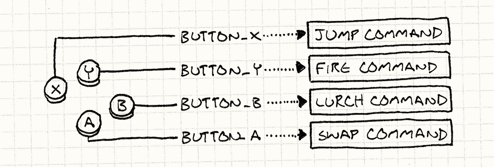

## 命令模式
命令模式是我最爱的设计模式之一。在很多我写过的大型程序里，命令模式都随处可以。他可以让一些原来丑陋的代码变得十分整洁。然而对于这样一个优秀的设计的模式，GOF给出的解释却十分晦涩。

>  a request as an object, thereby letting users parameterize clients with different requests, queue or log requests, and support undoable operations.  
> 将请求压缩成对象，使用不同的请求实现客户端参数化、排队、日志等功能，并且支持撤销操作。

我想你也觉得这个句子很难懂吧。首先它没有说明白它想比喻的内容，一些词脱离了计算机领域就会有不同的意思，比如client可以指一个人，你的客户，而“人”显然是不能被“参数化”的。接下来，这个句子介绍了一些可能用到该设计模式的地方，但如果不是你亲自遇到，是很难理解的。所以我给了命令模式一个精炼的定义。
> A command is a reified method call  
> 一个命令(command)就是一个具体化的方法调用。

当然，由于精炼带来的过度简化，导致这个定义依然难以理解。让我来进一步解释一下，“具体化"可以理解为"make real"，也可以理解为让方法变成"first-class"。这两种解释的本质都是说将一些内容封装到一个对象中去，然后将对象作为参数传递给函数。所以我将“命令"解释成”具体化的方法调用“，也就是说将一个函数调用函数封装成一个对象。

这听起来有点像回调函数、first-class函数,函数指针、闭包、偏应用函数等概念，这些概念本质上都差不多，只是取决于你用的语言不同。GOF也在书后提到

> Commands are an object-oriented replacement for callbacks.  
> 命令模式以面向对象的方式取代了回调函数

用这句话去解释命令模式比GOF之前的定义更加贴切。但无论怎讲解释，这些定义依然是十分抽象的，还是让我们用一些实际的例子来理解命令模式吧。

## 输入配置
在游戏代码中，我们经常需要一堆代码来处理用户输入，包括按钮、键盘、鼠标等，这些代码将用户输入转换成游戏中有意义的行为。

一个简单实现如下：
```cpp
void InputHandler::handleInput()
{
  if (isPressed(BUTTON_X)) jump();
  else if (isPressed(BUTTON_Y)) fireGun();
  else if (isPressed(BUTTON_A)) swapWeapon();
  else if (isPressed(BUTTON_B)) lurchIneffectively();
}
```
这个函数一般会在游戏中每帧调用一次，其作用也很容易理解。但是这段代码将按键和行为进行了硬编码，导致玩家无法在游戏中实现自定义按键。

为了实现自定义按键功能，我们将jump()和fireGun()这些直接的调用进行转变，使用对象来封装这些行为。进入：命令模式。

我们定义了一个基类表示一个可触发的游戏命令：
```cpp
class Command
{
public:
  virtual ~Command() {}
  virtual void execute() = 0;
};
```
> 当你有一个接口只有一个没有返回值的方法的时候，这是一个用命令模式的绝佳机会

然后我们再为不同的游戏行为定义不同的子类
```cpp
class JumpCommand : public Command
{
public:
  virtual void execute() { jump(); }
};

class FireCommand : public Command
{
public:
  virtual void execute() { fireGun(); }
};
// You get the idea...
```
在我们的InputHandler里，为每个按键都存了一个到命令的指针。
```cpp
class InputHandler
{
public:
  void handleInput();

  // Methods to bind commands...

private:
  Command* buttonX_;
  Command* buttonY_;
  Command* buttonA_;
  Command* buttonB_;
};
```
现在的输入部分是这样的
```cpp
void InputHandler::handleInput()
{
  if (isPressed(BUTTON_X)) buttonX_->execute();
  else if (isPressed(BUTTON_Y)) buttonY_->execute();
  else if (isPressed(BUTTON_A)) buttonA_->execute();
  else if (isPressed(BUTTON_B)) buttonB_->execute();
}
```
> 这里没有去检测指针是否为NULL，因为我们假设了所有的按键都是有对应行为的。如果想支持不做任何事情的行为，直接定义一个excute()方法为空的类，并将按键的指针指向该类即可。这种模式被称为“空对象“。

现在我们不再是直接的调用方法了，而是多了一层间接的映射。


以上简短介绍了命令模式。如果你能看出该模式的好处，就接着看剩下的内容吧。

## 角色操作
我们刚才定义的类有一个很大的局限，我们假定了这些顶层的jump()、fireGun()等指令都能找到玩家角色，并对其进行操作。而这个假定限制了这些函数的参数对象，所以我们现在不要爱让这些函数去寻找对象，而是将对象作为参数传进去：
```cpp
class Command
{
public:
  virtual ~Command() {}
  virtual void execute(GameActor& actor) = 0;
};
```
`GameActor`指的是游戏中的一个角色，我们将其传给execute()，继承的类就可以直接操作传递进去的对象了，就像这样：
```cpp
class JumpCommand : public Command
{
public:
  virtual void execute(GameActor& actor)
  {
    actor.jump();
  }
};
```
现在，我们这个类可以让任意角色进行跳跃了。我们修改了handleInput(),让它返回命令。
```cpp
Command* InputHandler::handleInput()
{
  if (isPressed(BUTTON_X)) return buttonX_;
  if (isPressed(BUTTON_Y)) return buttonY_;
  if (isPressed(BUTTON_A)) return buttonA_;
  if (isPressed(BUTTON_B)) return buttonB_;

  // Nothing pressed, so do nothing.
  return NULL;
}
```
因为这里并没有actor参数，所以不能立即调用。这里也看到了命令模式的另一个好处，我们可以延迟到它执行时再调用。

接着，我们需要一些代码来接收命令，并且传入具体的角色。
```cpp
Command* command = inputHandler.handleInput();
if (command)
{
  command->execute(actor);
}
```
假设actor是一个玩家角色的引用，这段代码能按照玩家的输入做出对应的行为。而通过这增加的一层重定向以及actor参数，我们可以通过改变actor参数，从而控制场景中任意一个角色。

实际上，这个特性并不通用，但经常会出现一些类似的用例。目前我们只考虑了玩家控制的角色，但是对于其他的被AI控制的角色呢？我们也可以用相同的命令模式来连接AI引擎和角色，AI代码只要生成命令对象就可以了。

这里AI代码和命令之间的解耦也给了我们更大的灵活度。我们可以给不同的角色绑定不同的AI模块，或者为多样的行为混合AI。想具有一个更加好斗的对手？给他一个更加好斗的AI去生成命令就可以了。实际上，我们可以把AI直接挂在玩家角色上，这在Demo模式下，游戏需要自动演示时，是十分有用的。

通过将命令封装成first-class对象，我们从这种直接调用的方式中进行了解耦。作为替代，我们也可使用一个队列或者命令流。


一些代码(InputHandler或者AI)将命令放到流中，而另一部分代码(分发者或者actor)获取命令并且运行她们。通过中间的队列，我们解耦了生产者与消费者。

> 如果我们对这些命令进行序列化，我们就可以在网络上发送它们。我们可以拿到用户的输入，发送到另一台机器上，并且重现它，这是网络多人游戏的基础。

## 撤销和重做

最后再举一个例子介绍命令模式广为应用的场景，假如一个命令可以做一件事，那么它就应该可以撤销这件事。撤销在一些策略游戏中经常用到，允许你对不喜欢的操作进行回滚。在游戏编辑器中撤销也是必须的，假如一个关卡编辑器中不能进行撤销操作，那么游戏设计师一定会恨死你的。

> 这是我的经验。

如果没有命令模式，实现撤销模式是十分困难的。但有了命令模式就变的十分容易了。假设我们在设计一款单人回合制游戏，我们加入了撤销操作，从而让玩家关注策略而不是猜测。

我们已经使用命令模式来实现了输入处理，所以我们可以获得所有的玩家操作。比如，移动一个单位
的命令可能如下实现：
```cpp
class MoveUnitCommand : public Command
{
public:
  MoveUnitCommand(Unit* unit, int x, int y)
  : unit_(unit),
    x_(x),
    y_(y)
  {}

  virtual void execute()
  {
    unit_->moveTo(x_, y_);
  }

private:
  Unit* unit_;
  int x_, y_;
};
```

这看起来和之前的命令有所不同。在上个例子中，我们抽象了命令给不同的角色使用。而这次我们只想将命令绑定到移动的单位上，这条命令并不是移动某个物体，而是回合制游戏中的一次具体的移动。

这展现了命令模式的另一个使用场景，在一些情况下，比如前面的例子，指令是一个可重用对象，表示一个可执行事件。我们之前的输入处理会就是在按键时调用对应命令对象的execute方法。

这里的命令更加特殊一些，表示了在特定时间点能做的事件。意味着输入处理代码会在任何玩家决定移动的时候，都会创建一个命令实例，如下：
```c++
Command* handleInput()
{
  Unit* unit = getSelectedUnit();

  if (isPressed(BUTTON_UP)) {
    // 向上移动单位
    int destY = unit->y() - 1;
    return new MoveUnitCommand(unit, unit->x(), destY);
  }

  if (isPressed(BUTTON_DOWN)) {
    // 向下移动单位
    int destY = unit->y() + 1;
    return new MoveUnitCommand(unit, unit->x(), destY);
  }

  // 其他的移动……

  return NULL;
}
```

然而这些命令只能使用一次，为了让命令可撤销，我们在基类中定义了一个操作undo，所有子类都要实现该方法。

```c++
class Command
{
public:
  virtual ~Command() {}
  virtual void execute() = 0;
  virtual void undo() = 0;
};
```

undo()方法回滚了对应execute方法做的操作。这是支持了undo操作的移动指令。
```c++
class MoveUnitCommand : public Command
{
public:
  MoveUnitCommand(Unit* unit, int x, int y)
  : unit_(unit),
    xBefore_(0),
    yBefore_(0),
    x_(x),
    y_(y)
  {}

  virtual void execute()
  {
    // Remember the unit's position before the move
    // so we can restore it.
    xBefore_ = unit_->x();
    yBefore_ = unit_->y();

    unit_->moveTo(x_, y_);
  }

  virtual void undo()
  {
    unit_->moveTo(xBefore_, yBefore_);
  }

private:
  Unit* unit_;
  int xBefore_, yBefore_;
  int x_, y_;
};
```

在这里我们给类添加了一些状态，因为当一个单位移动时，它就会忘了它曾经的状态。如果我们希望能够撤销这次移动，我们就需要通过`xBefore_`和`yBefore_`记住自己移动之前的位置。

为了让玩家能够撤销移动，我们记录了最后一条执行的命令，当他按下Ctrl-Z，我们就调用undo方法。(如果他已经执行了撤销，那么就变成redo，我们重新调用命令的execute方法。)

支持连续的undo操作也不难，我们只需要记录一个命令列表以及一个指向当前命令的指针即可。当玩家执行一条命令，我们将命令加到列表尾部，并且将当前命令指针指向它即可。


当玩家选择了"undo"操作，我们undo当前的指令并且将current回退一格，而当玩家选择了"Redo"操作，我们将指针指向下一条指令并且执行该命令。如果他在undo了一些指令后执行了一条新的指令，那么列表中当前指令之后的指令都会被废弃掉。

当我第一次在关卡编辑器中使用的时候，我感觉自己就是一个天才，我惊异于该模式的直接有效。它规定所有的操作都要通过一个指令来完成，只要你做到了这点，剩下的事情都很简单了。

## 类还是函数?

前面我说命令很想first-class函数或者闭包，但是我给出的例子都是使用类来完成的。如果你对函数式编程很熟悉，你可能会疑惑函数在哪。

我这样实现是因为c++对first-class的支持十分有限。函数指针是无状态的，仿函数比较怪异并且仍需要创建类，而C++11的lambda表达式因为手动的内存管理，也需要小心使用。

这不是说你不能在其他的语言中使用函数来实现命令模式。如果你使用语言具有闭包特性，那就使用它吧。可以说，在某种程度上，命令模式正是为一些没有闭包特性的语言模拟闭包。（有时候即使有闭包，也要将命令封装成类。对于包含多种操作的命令（比如可撤销的命令），只将它对应成一个函数是不够的。）

举个例子，使用javascript，我们可以这样构造一个移动指令：
```cpp
function makeMoveUnitCommand(unit, x, y) {
  // This function here is the command object:
  return function() {
    unit.moveTo(x, y);
  }
}
```

我们也可以通过一对闭包操作来支持撤销操作：
```c++
function makeMoveUnitCommand(unit, x, y) {
  var xBefore, yBefore;
  return {
    execute: function() {
      xBefore = unit.x();
      yBefore = unit.y();
      unit.moveTo(x, y);
    },
    undo: function() {
      unit.moveTo(xBefore, yBefore);
    }
  };
}
```

如果你习惯了函数式，这样实现十分子然。如果没有，我希望该节可以让你了解一些。对我来说，在命令模式上的实用性，展示了函数式编程在很多问题中都是十分有效的。

## 参见
- 你最终会定义很多命令类。为了实现的简单一些，可以定义一个具体的基类包含一些方便的高层方法，在派生类中去使用它们。这会将命令的主要execute方法转到子类沙箱模式中。

- 在我们的例子中，我们明确的指出了可处理命令的角色。在某些情况下，尤其当对象是分层时，也可以不必这样做。对象可以响应命令，也可以将命令交给所属的对象，这也是所谓的责任链模式。

- 有些命令式无状态的简单行为，比如前面的JumpCommand。这种情况下，创建多个实例是浪费内存的行为，享元模式可以处理该情况。


