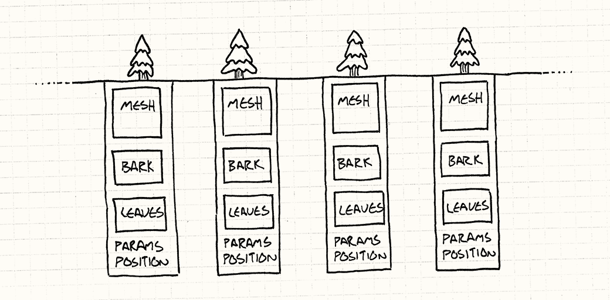

# 1.2 享元模式
  #图书/游戏编程模式#

迷雾散尽，显现出一个古老庄严的森林。无数古老的铁杉，在头顶形成了一个绿色的教堂。阳光被树叶分割成分割成金色的水平，在巨大的树干间，远处的森林逐渐模糊。

这是一个游戏开发者想象中的场景，这样的场景经常使用一个设计模式来实现：享元模式。

## 森林
我可以用几个词来形容一个巨大的森林，但是在一个实时游戏中实现就是另一回事了。当你看到屏幕上数不清的树木时，一个图形程序员看到的是每1/60秒要向GPU传送数百万个多边形进行绘制。

我们讨论的这成千上万的树，每一颗树木又有成千上万个多边形构成。就算有足够的内存来保存这个森林，为了渲染它们，从CPU向GPU传送这些数据也是会过载的。

每个树都有一些固定的特征
* 一个多边形网格来描述树枝、树干和树叶。
* 树皮和树叶的纹理。
* 它在森林中的位置和朝向
* 一些参数比如大小和色彩等，使得每棵树看起来都不一样

如果想用代码来描述这些特征，看起来如下所示：
```c++
class Tree
{
private:
  Mesh mesh_;
  Texture bark_;
  Texture leaves_;
  Vector position_;
  double height_;
  double thickness_;
  Color barkTint_;
  Color leafTint_;
};
```
这是相当多的数据量，尤其是网格和纹理数据十分大。一个巨大的森林包含如此多的数据，在一帧内传给GPU实在是太多了。幸运的是，有一个历史悠久的方法来解决它。

关键问题在于，即使森林中有成千上万的树，这些树看起来也是相似的。它们可能使用了相同的网格和纹理，这意味着这些树木实例中很多字段可以使用相同的对象。



我们可以将类分为两部分。首先，我们将所有树共享的数据拉出来放到一个单独的类里。
```c++
class TreeModel
{
private:
  Mesh mesh_;
  Texture bark_;
  Texture leaves_;
};
```

整个游戏只需要一个TreeModel实例，没有理由在内存里放数千个相同的网格和纹理。接下来，每个树的实例都会有一个到共享的TreeModel的引用。Tree类中余下的都是实例特有的字段。

```c++
class Tree
{
private:
  TreeModel* model_;

  Vector position_;
  double height_;
  double thickness_;
  Color barkTint_;
  Color leafTint_;
};
```

这个结构可以表现为下图：


这样做对在内存中存储十分有用，但对渲染却依然没有什么用处。将森林渲染到屏幕上之前，数据要先传送到GPU。我们需要以显卡可以理解的方式来共享数据。

## 一千个实例
为了减少传给GPU的数据，我们希望将共享的数据TreeModel只发送一次，然后我们再发送实例特有的数据，包括位置、颜色、缩放等。然后，我们告诉GPU，“使用同一个模型渲染这些实例。”

幸运的是，现代的显卡API都支持这样的实现，实现的细节已经超出了本书范围，但是Direct3D和OpenGL都可以做到实例渲染(Instanced Rendering)。

在这两者的API中，你需要提供两条数据流，第一条是需要渲染时使用多次的共享数据，在我们的实例中就是纹理和多边形网格。第二条就是实例的列表以及参数。然后调用一次渲染，一个森林就绘制好了。

## 享元模式
现在我们已经看了一个具体的例子，接下来让我们再介绍享元设计模式。享元模式，就像它的名字一样，如果一个对象比较通用并且数量众多，那么久可以让它变成共享的。

在实例渲染中，渲染每课树更多的消耗是把数据从CPU传送到GPU的时间，而不是内存，但是本质是相同的。

该设计模式通过将对象的数据分成两部分来解决这个问题，第一部分数据对于一个对象的所有实例来说都是相同的，可以在实例之间共享。GOF称此为固有状态，但是我更愿意称他们为“上下文无关的”。在该例中，指的就是树的网格和纹理。

数据的剩余部分就是非固化数据，在每一个实例中都不相同的。在该例中，指的就是树的位置、缩放和颜色。就像前面的代码一样，该模式通过共享同一份固有数据来节省内存。

但就目前而言，这种做法更像是资源共享，难以称的上是一种设计模式。这某种程度上是因为这个样例中我们对共享数据定义了清晰的身份：TreeModel。

我发现当我们没有为共享对象定义身份时，这个模式就不那么明显了。这时，感觉就像一个对象魔术般的分布了在不同的地方，让我给你展示另外一个例子。

## 扎根的地方
这些树生长的土地，在游戏中也是要被表示出来的。它们可能是草地、泥土、湖泊、小河等一切你可以想象到的地形。我们会基于块描述地表，地表可以被划分为由无数小块组成的网格。每个小块都由一种地形覆盖。

每个地形类型都会有一些属性影响它的游戏特性
- 移动代价决定玩家在该地形上的移动速度
* 标识地形是否是水决定船是否可通过
* 用于渲染它的纹理

因为我们游戏程序员是十分注重效率的，我们不可能将这些数据存储在世界的每一块中。一个常见的方法是使用一个枚举来表示地形类型。
```c++
enum Terrain
{
  TERRAIN_GRASS,
  TERRAIN_HILL,
  TERRAIN_RIVER
  // Other terrains...
};
```

整个世界可以使用一个巨大的网格来维护
```c++
class World
{
private:
  Terrain tiles_[WIDTH][HEIGHT];
};
```

为了获得一个块的实际数据，我们可以这样做
```c++
int World::getMovementCost(int x, int y)
{
  switch (tiles_[x][y])
  {
    case TERRAIN_GRASS: return 1;
    case TERRAIN_HILL:  return 3;
    case TERRAIN_RIVER: return 2;
      // Other terrains...
  }
}

bool World::isWater(int x, int y)
{
  switch (tiles_[x][y])
  {
    case TERRAIN_GRASS: return false;
    case TERRAIN_HILL:  return false;
    case TERRAIN_RIVER: return true;
      // Other terrains...
  }
}
```

你应该明白我的意思了。虽然这段代码是可行的，但我认为它很丑陋。我认为移动代价和水域标识等应该是地形数据的一部分，但这里是散在代码中的。更糟糕的是，地形的数据被拆分到了很多方法中。如果能将这些内容放在一起就好了，这才是符合面向对象的设计。

如果我们有如下的地形类，那就最好了
```c++
class Terrain
{
public:
  Terrain(int movementCost,
          bool isWater,
          Texture texture)
  : movementCost_(movementCost),
    isWater_(isWater),
    texture_(texture)
  {}

  int getMovementCost() const { return movementCost_; }
  bool isWater() const { return isWater_; }
  const Texture& getTexture() const { return texture_; }

private:
  int movementCost_;
  bool isWater_;
  Texture texture_;
};
```

但我们不想为世界中的每一个区块都保存一个实例，如果你仔细观察这个类，就会发现这个类中并没有字段表明该地形的位置。用享元模式的术语说，所有的地形状态都是“固有”的或者“上下文无关”的。

基于此，我们没必要为每一个地形类型保存多份，每一个草地块和其他的草地块并没有什么区别。我们也不再需要地形对象数组，而是使用一组指向地形的指针数组。
```c++
class World
{
private:
  Terrain* tiles_[WIDTH][HEIGHT];

  // Other stuff...
};
```

每个相同的地形都会指向同一个地形实例。


因为地形实例在很多地方都会用到，如果你是使用动态内存分配的，那么管理起来会有点复杂。因此，我们将这些实例直接存储在world中。
```c++
class World
{
public:
  World()
  : grassTerrain_(1, false, GRASS_TEXTURE),
    hillTerrain_(3, false, HILL_TEXTURE),
    riverTerrain_(2, true, RIVER_TEXTURE)
  {}

private:
  Terrain grassTerrain_;
  Terrain hillTerrain_;
  Terrain riverTerrain_;

  // Other stuff...
};
```

接下来我们可以这样去描绘大地。
```c++
void World::generateTerrain()
{
  // Fill the ground with grass.
  for (int x = 0; x < WIDTH; x++)
  {
    for (int y = 0; y < HEIGHT; y++)
    {
      // Sprinkle some hills.
      if (random(10) == 0)
      {
        tiles_[x][y] = &hillTerrain_;
      }
      else
      {
        tiles_[x][y] = &grassTerrain_;
      }
    }
  }

  // Lay a river.
  int x = random(WIDTH);
  for (int y = 0; y < HEIGHT; y++) {
    tiles_[x][y] = &riverTerrain_;
  }
}
```

现在我们不再需要World的方法来获得地形属性，我们可以直接暴露Terrain对象。
```c++
const Terrain& World::getTile(int x, int y) const
{
  return *tiles_[x][y];
}
```

通过这种方法，World类不再和各种地形的细节相耦合，如果你希望获得一些该地形的属性信息，你可以这样从对象中获得
```c++
int cost = world.getTile(2, 3).getMovementCost();
```

我们回到了操作实体对象的API，这样做没有几乎任何的额外性能开销——指针不会比一个枚举大。

## 关于性能

我在这里说“几乎”是因为肯定有程序员希望知道它与枚举比起来究竟如何。通过指针指向地形意味着一次额外的解引用。为了得到一些地形数据例如移动代价，你首先得通过指针拿到地形对象，然后再从中读到移动代价。跟踪这样的指针有可能引起缓存的不命中，从而导致系统性能的降低。

通常来说，优化的黄金规则是需求优先。现代计算机的硬件是十分复杂的，性能只是考虑的一个方面而已。在我这篇文章的测试中，享元相比枚举并没有什么优势。实际上，享元模式明显会更快，但这也取决于这些对象在内存中的排布方式。

我可以确定的是，使用享元模式不会让场面失控。它既有面向对象模式的优势，又不会创建一堆对象。如果你发现你创建了一个枚举并做了很多switch操作，你就可以考虑是不是可以使用享元模式了。如果你对性能感到担忧，在转换代码到一个难以维护的风格之前，先做一下性能测试。

## 参见
- 在关于地形块的例子中，我们预创建了每一种地形并存储在World中，这样使得实例便于寻找和复用。但在多数情况下，你并不想一开始就创建所有的享元。如果你不能预知你想要的实例，最好的方法就是在需要时创建。为了发挥共享的优势，在需要的时候，你可以先看看有没有已经创建的实例，如果有，直接返回就可以了。这通常意味着要将构造函数隐藏在一个查询对象是否存在的接口中，隐藏构造函数听起来像是一个工厂模式。

* 为了返回一个预创建好的享元，你不得不去管理你已经实例化的对象的池子。正如这个名字一样，使用一个对象池去管理是比较有用的方法。

- 当使用状态模式时，经常会出现一些没有任何特定字段的状态，这个状态的标识和方法已经够用了。这时，你就可以用该模式去管理这些状态，然后在不同的状态机上使用相同的实例


